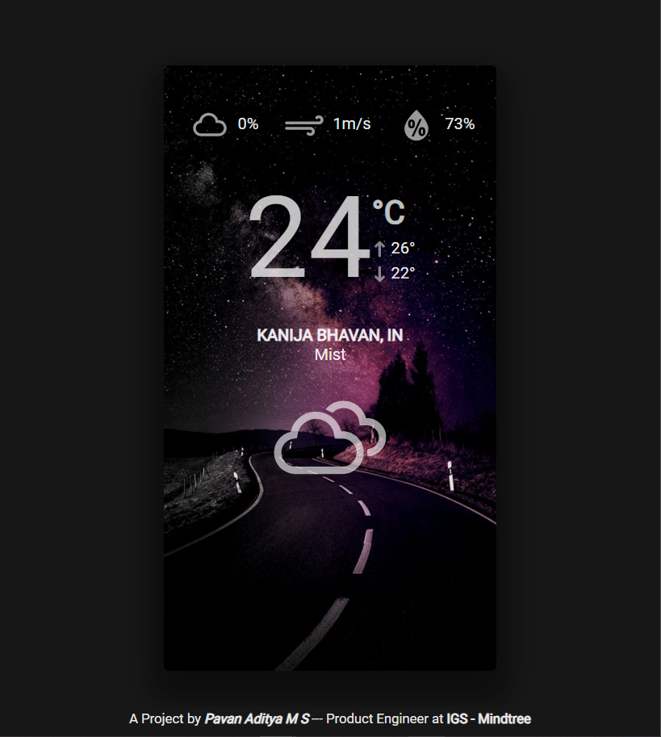

# Weather Forecast App

> A VueJs Project for showing the weather conditions in and around the user.

> Navigator GeoLocation method is used for fetching the current coordinates of the user. (Docs: https://developer.mozilla.org/en-US/docs/Web/API/Geolocation/getCurrentPosition)

> The Open Weather Map Apis are used for fetching the weather details api. (Website: https://home.openweathermap.org/)

> Other Cities weather can also be found by selecting the city name inside the city drop down (It gets opened on clicking the current city name)

# <a href="https://getmyweather.pavanaditya.com" target="_blank">App Demo</a>

## Build Setup

``` bash
# For installing dependencies
`npm i --save`

# For running the App and hot reloads
`npm run dev`
This is a script inside package.json. It runs the app on http://localhost:8080 location

# For building the app and packaging the app for production
`npm run build`
Webpack is used for packaging.

# For building to production and view the bundle analyzer report
npm run build --report


## Vue Official documentation and getting started links : https://vuejs.org/ and https://vuejs.org/v2/guide/
```
## Demo Images

* Day Time App Image


* Night Time App Image



# App Demo can be found at the following website https://getmyweather.pavanaditya.com
